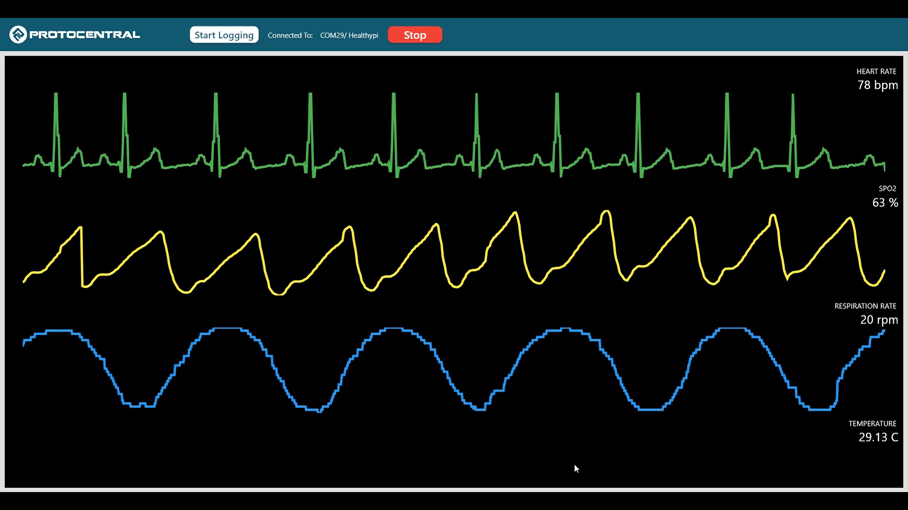

# OpenView 2

Openview 2 is designed as a companion application to receive data from various Protocentral boards. It can be used to visualize the data in real-time and also store the data in CSV format.

OpenView 2 will replace the existing [OpenView app](https://github.com/Protocentral/protocentral_openview2) written in Processing and will be the primary supported app for all Protocentral boards. OpenView 2 is based on the more modern [Flutter framework](https://flutter.dev/) and is available for Windows, MacOS, Linux, Android, and iOS.

The Android and iOS mobile versions use BLE to connect to the boards (when used with a microcontroller with BLE support), while the desktop version uses USB/UART to connect to the boards.

## Features:

* Multiple boards, one unified interface
* Mobile platforms: Android and iOS
* Desktop platforms: Windows, MacOS, and Linux
* Code development environment: [Flutter](https://flutter.dev/)
* Data storage option to CSV files
* You can add your own board by editing the source (for now, in the future we will add a more configurable way to add new boards)

## Supported Boards
* [HealthyPi 5](https://protocentral.com/product/healthypi-5-vital-signs-monitoring-hat-kit/)
* [HealthyPi Move](https://www.crowdsupply.com/protocentral/healthypi-move)

## Installing and using Protocentral OpenView 2

You can download the latest version for your operating system from the [Releases](https://github.com/Protocentral/Protocentral_openview2/releases) page.

OpenView 2 is written on the [Flutter](https://flutter.dev/) and is fully open source. You can compile your own from the source code provide in this GitHub repository.

### Using on Desktop Platforms:

1. Download the zip file from the [Releases](https://github.com/Protocentral/protocentral_openview2/releases) page.
2. Extract the zip file installed
3. Open the app in the folder extracted and run the application

### Using on Mobile Platforms:

Download the openview app from the [Google Play](https://play.google.com/store/apps/details?id=com.protocentral.openview) store for Android and from the [Apple App Store](https://apps.apple.com/fi/app/openview/id1667747246) for iOS.

 

## Packet Format

Protocentral OpenView 2 is compatible with any device that can send data through Serial port over UART/USB/Bluetooth-SPP/BLE

| Position      |   Value                       |
| ------------- | ----------------------------  |
| 0 - 7         | 0x0A (START)                  | 
| 8 - 15        | 0xFA (Type Indicator)         |
| 16 - 23       | Payload Length LSB            |
| 24 - 31       | Payload Length MSB            |
| 32 - 39       | 0x02 (Type - Data)            |
| 40 - 55       | ECG (16-bit MSB to LSB)       |
| 56 - 71       | ECG (16-bit MSB to LSB)       |
| 72 - 87       | ECG (16-bit MSB to LSB)       |
| 88 - 103      | ECG (16-bit MSB to LSB)       |
| 104 - 119     | ECG (16-bit MSB to LSB)       |
| 120 - 135     | ECG (16-bit MSB to LSB)       |
| 136 - 151     | ECG (16-bit MSB to LSB)       |
| 152 - 167     | ECG (16-bit MSB to LSB)       |
| 168 - 183     | Resp (16-bit MSB to LSB)      |
| 184 - 199     | Resp (16-bit MSB to LSB)      |
| 200 - 215     | Resp (16-bit MSB to LSB)      |
| 216 - 231     | Resp (16-bit MSB to LSB)      |
| 232 - 239     | BioZ skip sample flag         |
| 240 - 255     | PPG - Red (16-bit MSB to LSB) |
| 256 - 271     | PPG - Red (16-bit MSB to LSB) |
| 272 - 287     | PPG - Red (16-bit MSB to LSB) |
| 288 - 303     | PPG - Red (16-bit MSB to LSB) |
| 304 - 319     | PPG - Red (16-bit MSB to LSB) |
| 320 - 335     | PPG - Red (16-bit MSB to LSB) |
| 336 - 351     | PPG - Red (16-bit MSB to LSB) |
| 352 - 367     | PPG - Red (16-bit MSB to LSB) |
| 368 - 383     | PPG - IR (16-bit MSB to LSB)  |
| 384 - 399     | PPG - IR (16-bit MSB to LSB)  |
| 400 - 415     | PPG - IR (16-bit MSB to LSB)  |
| 416 - 431     | PPG - IR (16-bit MSB to LSB)  |
| 432 - 447     | PPG - IR (16-bit MSB to LSB)  |
| 448 - 463     | PPG - IR (16-bit MSB to LSB)  |
| 464 - 479     | PPG - IR (16-bit MSB to LSB)  |
| 480 - 495     | PPG - IR (16-bit MSB to LSB)  |
| 496 - 511     | Temperature (16-bit)          |
| 512 - 519     | SpO2                          |
| 520 - 527     | Heart Rate                    |
| 528 - 535     | Resp Rate                     |
| 536 - 543     | 0x00                          |
| 544 - 551     | 0x0B (STOP)                   |

The following diagram represents the packet format.

# License

This software is open source and licensed under the following license:

MIT License

Copyright (c) 2019 Protocentral

Permission is hereby granted, free of charge, to any person obtaining a copy
of this software and associated documentation files (the "Software"), to deal
in the Software without restriction, including without limitation the rights
to use, copy, modify, merge, publish, distribute, sublicense, and/or sell
copies of the Software, and to permit persons to whom the Software is
furnished to do so, subject to the following conditions:

The above copyright notice and this permission notice shall be included in all
copies or substantial portions of the Software.

THE SOFTWARE IS PROVIDED "AS IS", WITHOUT WARRANTY OF ANY KIND, EXPRESS OR
IMPLIED, INCLUDING BUT NOT LIMITED TO THE WARRANTIES OF MERCHANTABILITY,
FITNESS FOR A PARTICULAR PURPOSE AND NONINFRINGEMENT. IN NO EVENT SHALL THE
AUTHORS OR COPYRIGHT HOLDERS BE LIABLE FOR ANY CLAIM, DAMAGES OR OTHER
LIABILITY, WHETHER IN AN ACTION OF CONTRACT, TORT OR OTHERWISE, ARISING FROM,
OUT OF OR IN CONNECTION WITH THE SOFTWARE OR THE USE OR OTHER DEALINGS IN THE
SOFTWARE.
